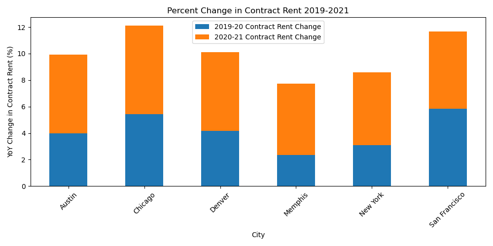
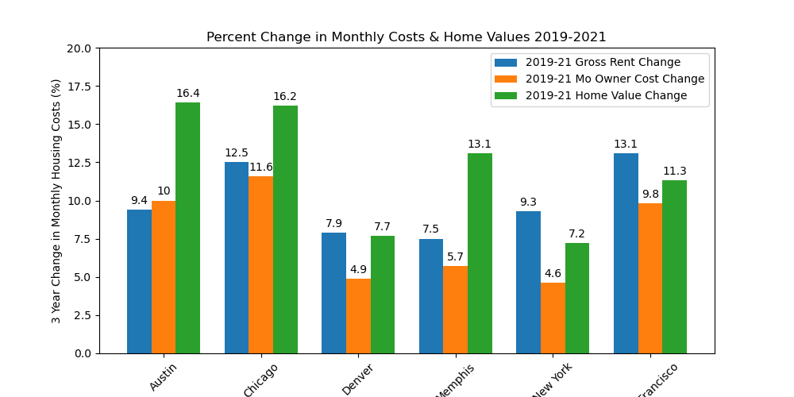
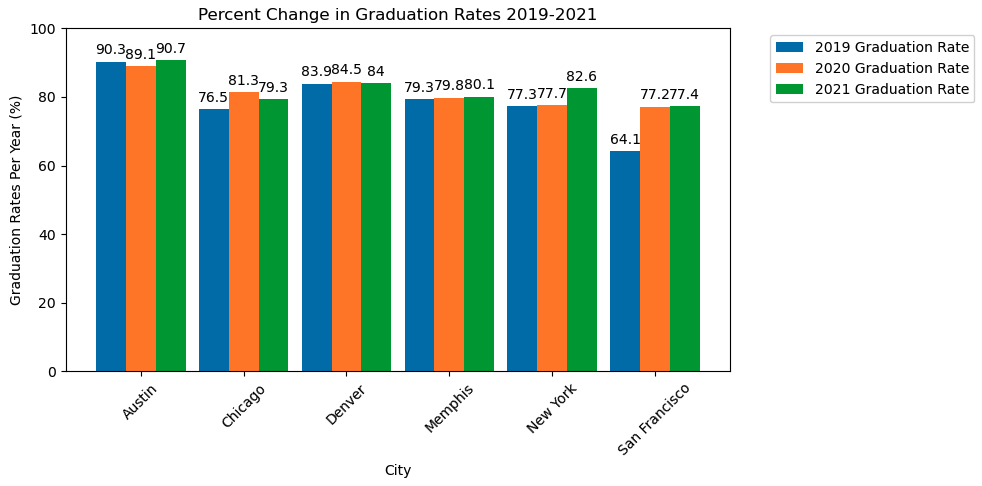
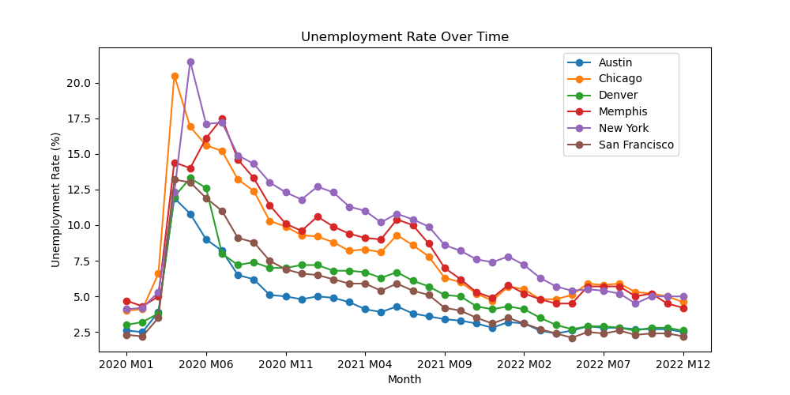
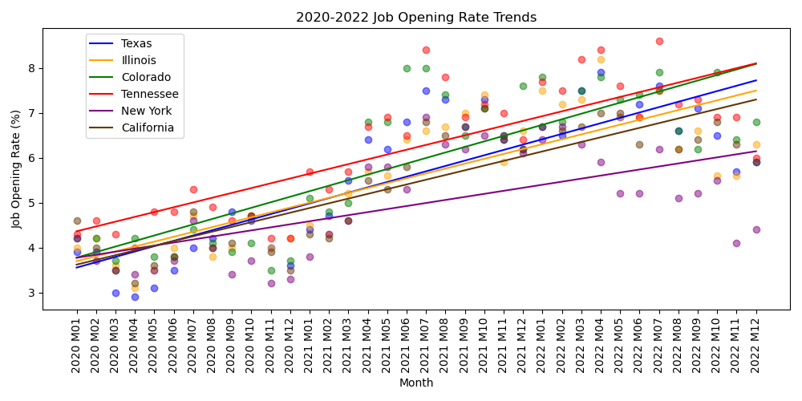

# US Real Estate Investing
In this project, we'll be working as a data analyst for a prominent real estate investment firm. Our task is to conduct research and provide expert insights to a high-profile client who is looking to invest in residential properties.
Our client wants to know which cities or regions have the highest potential for a profitable real estate investment.
> Client Persona:
 - Couple in early 50s located in suburbia Tampa, FL with teo fully independent children
 - Focus Areas:
   - Starter Homes: up to 1500 sq. ft; up to 3 bedrooms; single family homes, townhomes, or condos
   - Target Cities: Austin, Chicago, Denver, Memphis, New York, San Francisco
 - Desired Evidence:
   - City population and property values are growing
   - Profitability: Rental costs outweigh mortgage / difference trending up
   - Is the city attracting starter home families? school performance, low crime rates, positive job market

## Key Questions, Answered, Data Source, Notebook
 - Population trends across target cities (*Cory* to update - be more specific than starter text; add more bullets if needed)
   - Data Source(s):
   - Notebook(s) / Contributor(s):
 - Property value trends across target cities (*Aaron* to update - be more specific than starter text; add more bullets if needed)
   - Data Source(s):
   - Notebook(s) / Contributor(s):
 - Are rental prices growing, if so where is best?
   - Data Source(s): Census Python API: https://www.census.gov/data/developers/guidance/api-user-guide.html
   - Notebook(s) / Contributor(s): Rent_Pricing.ipynb / Rebekah Aldrich
 - In which cities are rental costs  growing faster than mortgage costs (are there top cities)?
   - Data Source(s): Census Python API: https://www.census.gov/data/developers/guidance/api-user-guide.html 
   - Notebook(s) / Contributor(s): Rent_Pricing.ipynb / Rebekah Aldrich
 - In which cities are schools most performant? 
   - Data Source(s): 
        Austin: https://tea.texas.gov/reports-and-data/school-performance/accountability-research/completion-graduation-and-dropout
        Chicago: https://www.illinoisreportcard.com/district.aspx?source=trends&source2=graduationrate&Districtid=15016299025
        Denver: https://www.cde.state.co.us/cdereval/gradratecurrent
        Memphis: https://www.publicschoolreview.com/tennessee/shelby-county-school-district/4700148-school-district
        New York City: https://infohub.nyced.org/reports/academics/graduation-results
        San Francisco: https://www.cde.ca.gov/nr/ne/yr20/yr20rel101.asp
   - Notebook(s) / Contributor(s): School_Grad_Data.ipynb / Tait Ralston & Dulce Silva
 - In which cities are crime rates lowest? (*Brannan* to update - be more specific than starter text; add more bullets if needed)
   - Data Source(s):
   - Notebook(s) / Contributor(s):
 - In which cities is the job market most positive?
   - Data Source(s): U.S. Bureau of Labor Statistics API: https://www.bls.gov/developers/home.htm
   - Notebook(s) / Contributor(s): BLS_Employment_Data.ipynb / Rebekah Aldrich


## Recommendation Summary
Denver, Colorado is consistently in top consideration across categories whereas other target cities fluctuate more within rankings by category. 
Denver Highlights:
 - Key Factors:
   - 3rd in population growth
   - 3rd in potential profitability (rental prices outpacing ownership prices)
   - ??? housing market trends
 - Other Considerations for city attractiveness:
    - 1st in job market outlook (combined unemployment and job openings)
    - 2nd in graduation rates
    - MAYBE lowest in crime rates

**Next Steps**
 - With reduced city list, further dig into city vs. suburb (zip codes), specific schools
 - Clarify profitability
    - mortgage + management + property tax costs vs. rental prices
    - average time to re-coup investment
    - long term vs. short term rentals
 - Clarify attractiveness
    - focus on property crime rates
    - school performance on standardized tests


## Analysis
### Population
(*Cory* update header add content)
### Property... 
(*Aaron* update header  add content)
### Potential for Profitability Growth
**Data**: Median Contract Rent (average rent), Median Gross Rent (average cost of rent and utilities combined), Median Home Value (average value of an owner-occupied home), Median Monthly Owner Costs (average monthly housing expense for a homeowner with a mortgage) available through the Census Pythoon API ([alias descriptions](https://github.com/datamade/census))
 - Median Contract Rent was used to give a view of what our clients would pull in as income
 - Median Monthly Owner Costs are interpreted to be mortgage and utilities combined. A compare between Median Gross Rent and Median Monthly Owner Costs serve as a proxy for evaluation growth rates of Rent Cost vs. Mortgage Costs. 
 - Median Home Value was evaluated for growth over time to identify potential profitability of re-selling in the future.<br> 

**Results:** 
A single city does not stand out as top across all the views created. However, San Francisco consistently is the top consideration while other cities fluctiate in rankings. Chicago comes up positively in two of the three views. Denver also shows up positively in two of the three views, but not as strongly as Chicago.

Austin and Chicago show the most growth in home value while Memphis and San Francisco are in the next grouping.

2019-2020 Change in Rent by City | 2019-2020 Change in Monthly Costs & Home Value by City
:-------------------------:|:-------------------------:
Chicago and San Francisco have the highest % change in rental values with Austin and Denver in the next group. | New York has the highest differential between gross rental cost growth and mortgage costs growth with San Francisco and Denver coming in the next grouping (i.e. rental costs outpacing mortage costs). 
  |  

### Comparison of School Graduation Rate Percentages by City
**Data** Graduation reates were used because... We consider this less accurate than other measures such as comparing performance on standardized tests.

**Results**
As seen in the data, Austin schools have the best graduation rate percentages, followed by Denver schools.
 - Austin shows the highest percentages over the 3 years which would make it the top choice in terms of schools in our investment search.
 - Overall, it is good to see all the cities we are evaluating have promising statistics in terms graduation rate percentages.
 - In the graph, San Francisco schools show the greatest improvement in graduation rate percentage over the 3 years analyzed compared to the other cities which were relatively static.



### Crime Rates
(*Brannan* update header  add content)
### Job Market
**Data:** Local Area Unemployment Rates & Job Openings Rates from 2020 through 2022 for target cities gathered through U.S. Bureau of Labor Statistics API ([list of Series IDs](https://www.bls.gov/help/hlpforma.htm)). The Local Area Unemployment Statistics (LAUS) program is a federal-state cooperative effort in which monthly estimates of total employment and unemployment are prepared for over 7,600 local areas. The job openings rate is computed by dividing the number of job openings by the sum of employment and job openings and multiplying that quotient by 100 at sate level.<br>

**Results:**
Considering both local unemployment rates and state job opening rates, Denver Colorado has the best performance out of the target cities. ANOVA and T tests were completed to verify differences seen within the charts.

2020-2022 Unemployment Rates by City | 2020-2022 Job Opening Rates by State
:-------------------------:|:-------------------------:
Colorado & Tenneesee have statistically higher jop openings than Texas, Illinois, New York, and California. Colorado shows the most growth (higher regression slope). Texas comes in third for job openings rate.| Denver, Austin, and San Francisco have statistically lower unemployment rates than Chicago, Memphis, New York; San Francisco is statistically lower than Denver and Austin while Denver and Austin are on the edge of statistical difference.
  |  


## Getting Started
### Prerequisites

You must have Python 3, Anaconda, Conda and Pip installed

```
$ python3 --version
Output: Python 3.10.11
$ anaconda --version
Output: anaconda Command line client (version 1.11.3)
$ conda --verison
Output: conda 23.5.0
$ pip --verison
Ouput: pip 23.1.2 from /Users/{#Username}/opt/anaconda3/lib/site-packages/pip (python 3.10)
```

### Cloning Repo, Installing Dependencies & Running Jupyter
```
$ git clone https://github.com/vt-bekah/Project1.git
$ cd Project1
$ jupyter lab
```

## Built With
- []([https://www.python.org/downloads/) - Programming Language
- [](https://pandas.pydata.org/docs/#) - Data analysis library
- [](https://numpy.org/) - Multi-dimensional array library
- [](https://docs.conda.io/en/latest/) - Package manager
- [Matplotlib](https://hvplot.holoviz.org/) - Visualization library 
- [Hvplot](https://hvplot.holoviz.org/) - Visualization library for Pandas-based plots
- [Pathlib](https://plotly.com/python/) - Python module for paths
- [Scipy](https://scipy.org/) - Python module for statistics


# SECTION TO BE REMOVED AFTER THE ABOVE CONTAINS SOURCES :Data Sources 
**target cities are a must:** will alter city list if gap in available data  
**over time:** last 2-3 years? monthly?  
**bonus:** across US to pull high/low for potential other places of interest to call out for client  

0. Overall
     * **Is there an API?** Stats about all US cities - real estate, relocation info, crime, house prices, schools, races, income, photos, sex offenders, maps, education, weather, home value estimator, recent sales, etc. https://www.city-data.com/ 
1. Real Estate (property sales - qty & $)
     * **API** Property Data API: https://www.attomdata.com/solutions/property-data-api/  
     * **API** Census Economic Indicators: https://www.census.gov/data/developers/data-sets/economic-indicators.html  
     * **API** Housing Prices: https://blog.data.nasdaq.com/api-for-housing-data  
     * **API** Realtor API: http://realtor.com/
2. Population (growth over time; specific economics?)
     * **API** Census Population Estimates and Projections: https://www.census.gov/data/developers/data-sets/popest-popproj.html  
     * **API** Census Migration Flows: https://www.census.gov/data/developers/data-sets/acs-migration-flows.html
     * **API** FRED: https://pypi.org/project/fredapi/       
3. Job Market (unemployment, top job types, bonus: job openings?)
     * **API** Census Economic Indicators: https://www.census.gov/data/developers/data-sets/economic-indicators.html  
     * **data** 2019 unemployment rates of 50 largest cities: https://www.bls.gov/lau/lacilg19.htm  
     * **API** US Bureau of Labor Statistics: https://www.bls.gov/developers/home.htm
       * doc: pull (id) options: https://www.bls.gov/help/hlpforma.htm#LA
       * doc: location codes: https://download.bls.gov/pub/time.series/la/la.area
4. Tax Rates (Property, Income?, Sales?)  
     * ~~Avg 2023 State Property Taxes varies by source: https://www.rocketmortgage.com/learn/property-taxes-by-state, https://belonghome.com/blog/property-taxes-by-state, https://wallethub.com/edu/states-with-the-highest-and-lowest-property-taxes/11585, https://www.bankrate.com/real-estate/property-tax-by-state/#what-are~~
     * **data** GitHub link for Tax Foundation data: https://github.com/TaxFoundation
       * **data** 2023 State Tax Collections per Capita: https://taxfoundation.org/2023-state-tax-data/
       * **data** 2023 Combined State + Local sales tax rates by state: https://taxfoundation.org/publications/state-and-local-sales-tax-rates/  
       * **data** Property tax trend by state 2020-23: https://taxfoundation.org/ranking-property-taxes-2023/
       * **data** 2023 Income tax rates by state: https://taxfoundation.org/state-income-tax-rates-2023/  
     * **API** (free trial option) Nationwide Proprty Tax Reporting: https://dna.firstam.com/taxsource 
5. Crime Rates (Violent vs. Property)
     * **API** Worldwide: https://www.crimeometer.com/crime-data-api 
     * **data** Austin: https://data.austintexas.gov/Public-Safety/Crime-Reports/fdj4-gpfu 
     * **data** San Francisco: https://datasf.org/opendata/
     * **data** Denver: https://www.denvergov.org/opendata
     * **Issue! data** Pittsburgh: https://pittsburghpa.gov/open-data/stories.html
     * **Issue! data** Las Vegas: https://files.lasvegasnevada.gov/open-data/Open_Data_Guide_for_CLV__ODSC_Approved_.pdf  
     * **data** Memphis: https://data.memphistn.gov/browse?limitTo=datasets  
     * **data** New York: https://data.cityofnewyork.us/Public-Safety/NYC-crime/qb7u-rbmr
     * **data** Chicago: https://data.cityofchicago.org/Public-Safety/Crimes-2022/9hwr-2zxp/data  
     * ...
6. Potentially add school district ratings
     * **API** Realtor API: https://www.realtor.com/
     * **API** https://www.greatschools.org/api/
7. Other potential
     * Areas with populations of 65,000+. Covers a broad range of topics about social, economic, demographic, and housing characteristics of the U.S. population. https://www.census.gov/data/developers/data-sets/acs-1year.html  
     * High-level detailed tables tabulated on the 1-year microdata for geographies with populations of 20,000 or more. https://www.census.gov/data/developers/data-sets/ACS-supplemental-data.html 
     * ChatGPT suggesting realtor:
        * Zillow API: Zillow, a popular online real estate marketplace, offers APIs that provide access to property data, home values, rental information, and more.
        * Realtor API: Realtor.com's API provides access to real estate listings, property details, photos, and local market trends.
        * Redfin API: Redfin's API offers access to real estate listings, property details, and local market information, including home sale data and pricing trends.
        * Trulia API: Trulia, another prominent online real estate platform, provides APIs that offer access to property data, neighborhood details, and local market trends.
        * MLS (Multiple Listing Service) API: MLS APIs are offered by various local real estate boards and associations, providing access to real-time property listings, sales data, and more.
        * Estated API: Estated provides APIs for property data, including property details, ownership information, and historical sales data.
        * Walk Score API: Walk Score offers an API that provides walkability scores and neighborhood information to assess the accessibility and convenience of different locations.
        * Attom Data Solutions API: Attom Data Solutions provides APIs that offer access to a wide range of real estate data, including property details, ownership information, mortgage data, and more.
        * RentRange API: RentRange's API focuses on rental market data, including rental rates, vacancy rates, and rental market trends.
        * Onboard Informatics API: Onboard Informatics provides APIs that offer access to various real estate data, including property details, neighborhood demographics, and local amenities       
     * Report on Taxes across US (not per city): chrome-extension://efaidnbmnnnibpcajpcglclefindmkaj/https://www.lincolninst.edu/sites/default/files/pubfiles/50-state-property-tax-comparison-for-2016-full.pdf               
