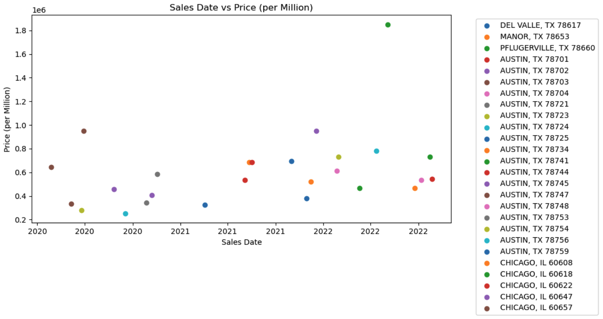
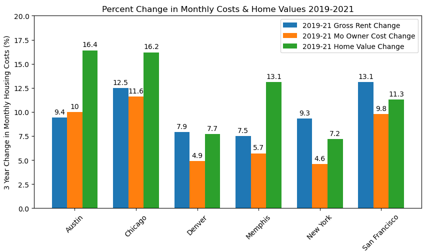

# US Real Estate Investing
In this project, we'll be working as a data analyst for a prominent real estate investment firm. Our task is to conduct research and provide expert insights to a high-profile client who is looking to invest in residential properties.
Our client wants to know which cities or regions have the highest potential for a profitable real estate investment.
> Client Persona:
 - Couple in early 50s located in suburbia Tampa, FL with teo fully independent children
 - Focus Areas:
   - Starter Homes: up to 1500 sq. ft; up to 3 bedrooms; single family homes, townhomes, or condos
   - Target Cities: Austin, Chicago, Denver, Memphis, New York, San Francisco
 - Desired Evidence:
   - City population and property values are growing
   - Profitability: Rental costs outweigh mortgage / difference trending up
   - Is the city attracting starter home families? school performance, low crime rates, positive job market

## Key Questions, Answered, Data Source, Notebook
 - Population trends across target cities 
   - Data Source(s): Census Python API: https://www.census.gov/data/developers/guidance/api-user-guide.html, Census Data Wrapper: https://pypi.org/project/census/
   - Notebook(s) / Contributor(s): full_population_analysis.ipynb / Cory Selzer
 - Sales trends across target cities 
   - Data Source(s):https://www.attomdata.com/
   - Getting an api_key for Attom got to: https://api.developer.attomdata.com/signup
Create and account, for company I put UofT Bootcamp and for industry put other. 
   - Notebook(s) / Contributor(s):sales_trend.ipynb / Aaron Summers & Rebekah Aldrich
 - Houses Available
   - Data Source(s):https://www.attomdata.com/
   - Notebook(s) / Contributor(s):house.ipynb / Aaron Summers & Rebekah Aldrich
 - Are rental prices growing, if so where is best?
   - Data Source(s): Census Python API: https://www.census.gov/data/developers/guidance/api-user-guide.html
   - Notebook(s) / Contributor(s): Rent_Pricing.ipynb / Rebekah Aldrich
 - In which cities are rental costs  growing faster than mortgage costs (are there top cities)?
   - Data Source(s): Census Python API: https://www.census.gov/data/developers/guidance/api-user-guide.html 
   - Notebook(s) / Contributor(s): Rent_Pricing.ipynb / Rebekah Aldrich
 - In which cities are schools most performant? 
   - Data Source(s): 
        Austin: https://tea.texas.gov/reports-and-data/school-performance/accountability-research/completion-graduation-and-dropout
        Chicago: https://www.illinoisreportcard.com/district.aspx?source=trends&source2=graduationrate&Districtid=15016299025
        Denver: https://www.cde.state.co.us/cdereval/gradratecurrent
        Memphis: https://www.publicschoolreview.com/tennessee/shelby-county-school-district/4700148-school-district
        New York City: https://infohub.nyced.org/reports/academics/graduation-results
        San Francisco: https://www.cde.ca.gov/nr/ne/yr20/yr20rel101.asp
   - Notebook(s) / Contributor(s): School_Grad_Data.ipynb / Tait Ralston & Dulce Silva
 - In which cities are crime rates lowest?
   - Data Source(s): 
        Austin: https://data.austintexas.gov/Public-Safety/Crime-Reports/fdj4-gpfu
        Chicago: https://data.cityofchicago.org/Public-Safety/Crimes-2001-to-Present/ijzp-q8t2/data
        Denver: https://www.denvergov.org/opendata/dataset/city-and-county-of-denver-crime
        Memphis: https://data.memphistn.gov/Public-Safety/Memphis-Police-Department-Aggregate-Crime/n7ue-iwew
        New York City: https://data.cityofnewyork.us/Public-Safety/NYPD-Arrests-Data-Historic-/8h9b-rp9u
        San Francisco: https://data.sfgov.org/browse?category=Public+Safety
   - Notebook(s) / Contributor(s): crime-data.ipynb / Brannan Geshwind
   - NOTE: When using Jupyter Lab notebook for crime data, please use the following link to download the .csv files, as the filesizes exceed the Git repository file size limit. https://drive.google.com/drive/folders/1YZleML3H3upn3kOD3Mp36WhDErgkZV_C?usp=drive_link
 - In which cities is the job market most positive?
   - Data Source(s): U.S. Bureau of Labor Statistics API: https://www.bls.gov/developers/home.htm
   - Notebook(s) / Contributor(s): BLS_Employment_Data.ipynb / Rebekah Aldrich


## Recommendation Summary
Denver, Colorado is consistently in top consideration across categories whereas other target cities fluctuate more within rankings by category. 
Denver Highlights:
 - Key Factors:
   - 3rd in population growth
   - 3rd in potential profitability (rental prices outpacing ownership prices)
 - Other Considerations for city attractiveness:
    - 1st in job market outlook (combined unemployment and job openings)
    - 2nd in graduation rates
    - Lowest amount of crime and crime rate

**Next Steps**
 - With reduced city list, further dig into city vs. suburb (zip codes), specific schools
 - Clarify profitability
    - mortgage + management + property tax costs vs. rental prices
    - average time to re-coup investment
    - long term vs. short term rentals
 - Clarify attractiveness
    - focus on property crime rates
    - school performance on standardized tests


## Analysis
### Population
**Data**: Population Growth Rate for each individual year (2019-2020 and 2020-2021) as well as net Population Growth Rate from 2019-2021.

**Results**: 
As shown in the charts, the New York City urbanized area grew the most in terms of population rate, with greater than 3.7% growth.  
 - Chicago and Denver showed the second and third most growth respectively, with each city almost reaching 1% growth.
 - Memphis is the only city that showed a population decrease.


### House Sales Trends 
**Data**: We looked into the sales trends and houses avaliable with these parameters for both,1-3 bedrooms, square foot max of 1500 sq. ft, and are zoned residential. Sales trends captured sales in a range from 1/1/2020-12/31/2022 with the other given parameters above.
House data looked at house in those 6 cities within our parameters and told us at this time no houses are available.

**Results**: Overall the code does what it is programed to do looking through the data with these parameters( 1-3 bedrooms, square foot max of 1500 sq. ft, and are zoned residential) but I think with us looking at zip codes for city’s most of which are urban areas it limits the results with our given parameters.

### Potential for Profitability Growth
**Data**: Median Contract Rent (average rent), Median Gross Rent (average cost of rent and utilities combined), Median Home Value (average value of an owner-occupied home), Median Monthly Owner Costs (average monthly housing expense for a homeowner with a mortgage) available through the Census Pythoon API ([alias descriptions](https://github.com/datamade/census))
 - Median Contract Rent was used to give a view of what our clients would pull in as income
 - Median Monthly Owner Costs are interpreted to be mortgage and utilities combined. A compare between Median Gross Rent and Median Monthly Owner Costs serve as a proxy for evaluation growth rates of Rent Cost vs. Mortgage Costs. 
 - Median Home Value was evaluated for growth over time to identify potential profitability of re-selling in the future.<br> 

**Note:** This data is not limited to starter homes as that was not found readily available for free.

**Results**: 
A single city does not stand out as top across all the views created. However, San Francisco consistently is the top consideration while other cities fluctiate in rankings. Chicago comes up positively in two of the three views. Denver also shows up positively in two of the three views, but not as strongly as Chicago.

Austin and Chicago show the most growth in home value while Memphis and San Francisco are in the next grouping.

2019-2020 Change in Rent by City | 2019-2020 Change in Monthly Costs & Home Value by City
:-------------------------:|:-------------------------:
Chicago and San Francisco have the highest % change in rental values with Austin and Denver in the next group. | New York has the highest differential between gross rental cost growth and mortgage costs growth with San Francisco and Denver coming in the next grouping (i.e. rental costs outpacing mortage costs). 
  |  

### Comparison of School Graduation Rate Percentages by City
**Data**: Graduation rates were used because we were able to acquire free school rating data that would be utilized on websites like Zillow, RedFin, etc. However, this data may be considered less accurate than other measures such as comparing performance on standardized tests. For the sake of this project and time, we utilimately decided on school graduation rate percentages.

**Results**:
As seen in the data, Austin schools have the best graduation rate percentages, followed by Denver schools.
 - Austin shows the highest percentages over the 3 years which would make it the top choice in terms of schools in our investment search.
 - Overall, it is good to see all the cities we are evaluating have promising statistics in terms graduation rate percentages.
 - In the graph, San Francisco schools show the greatest improvement in graduation rate percentage over the 3 years analyzed compared to the other cities which were relatively static.

Austin Graduation Rates Stats | Denver Graduation Rates Stats
:-------------------------:|:-------------------------:
*Mean of Graduation Rates:* 90.47 | *Mean of Graduation Rates:* 83.96
*Median of Graduation Rates:* 95.1 | *Median of Graduation Rates:* 87.9
*Standard Deviation of Graduation Rates:* 15.61 | *Standard Deviation of Graduation Rates:* 12.47
*Standard Error of Graduation Rates:* 1.40 | *Standard Error of Graduation Rates:* 2.32


### Crime Rates
**Data**: From the information gathered from each cities respective files from official city resources. The data includes dates, times, and descriptions of crimes, amongst other information. As each city and state is different, each .csv file had empty spaces as well as information that wasn't included in other cities, such as beats in NYC.

**Results**: In conclusion, Denver, followed by Austin and Memphis, are the lowest in terms of Total Crimes. Denver is the lowest amount of crime, but is increasing year after year. It is still the lowest of all of the cities. Chicago and New York City showed to be the highest amounts, with Chicago taking the top spot.


### Job Market
**Data:** Local Area Unemployment Rates & Job Openings Rates from 2020 through 2022 for target cities gathered through U.S. Bureau of Labor Statistics API ([list of Series IDs](https://www.bls.gov/help/hlpforma.htm)). The Local Area Unemployment Statistics (LAUS) program is a federal-state cooperative effort in which monthly estimates of total employment and unemployment are prepared for over 7,600 local areas. The job openings rate is computed by dividing the number of job openings by the sum of employment and job openings and multiplying that quotient by 100 at sate level. Note that the job openings data was not available by state not by city so I used state as the proxy.<br>

**Results:**
Considering both local unemployment rates and state job opening rates, Denver Colorado has the best performance out of the target cities. ANOVA and T tests were completed to verify differences seen within the charts.

2020-2022 Unemployment Rates by City | 2020-2022 Job Opening Rates by State
:-------------------------:|:-------------------------:
Colorado & Tenneesee have statistically higher jop openings than Texas, Illinois, New York, and California. Colorado shows the most growth (higher regression slope). Texas comes in third for job openings rate.| Denver, Austin, and San Francisco have statistically lower unemployment rates than Chicago, Memphis, New York; San Francisco is statistically lower than Denver and Austin while Denver and Austin are on the edge of statistical difference.
  |  


## Getting Started
### Prerequisites

You must have Python 3, Anaconda, Conda and Pip installed

```
$ python3 --version
Output: Python 3.10.11
$ anaconda --version
Output: anaconda Command line client (version 1.11.3)
$ conda --verison
Output: conda 23.5.0
$ pip --verison
Ouput: pip 23.1.2 from /Users/{#Username}/opt/anaconda3/lib/site-packages/pip (python 3.10)
```
**If executing certain notebooks, you will need to create a config.py file with API keys as indicated in the notebooks:**

If running the house or sales_trend notebook, you must get an ATTOM API key:
> https://api.developer.attomdata.com/signup

If running the full_population_analysis, you must get a Census API key
> https://www.census.gov/data/developers/guidance/api-user-guide.html


### Cloning Repo, Installing Dependencies & Running Jupyter
```
$ git clone https://github.com/vt-bekah/Project1.git
$ cd Project1
$ jupyter lab
```

## Built With
- []([https://www.python.org/downloads/) - Programming Language
- [](https://pandas.pydata.org/docs/#) - Data analysis library
- [](https://numpy.org/) - Multi-dimensional array library
- [](https://docs.conda.io/en/latest/) - Package manager
- [Matplotlib](https://hvplot.holoviz.org/) - Visualization library 
- [Hvplot](https://hvplot.holoviz.org/) - Visualization library for Pandas-based plots
- [Pathlib](https://plotly.com/python/) - Python module for paths
- [Scipy](https://scipy.org/) - Python module for statistics


